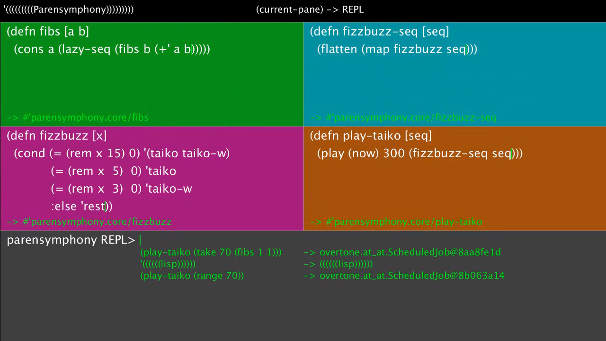

# Parensymphony

Live coding environment for audio visual performance using lisp (Clojure.)

[Video](https://www.youtube.com/watch?v=nxhqeIrgpfg)  
[Blog Post](http://soma.hatenablog.jp/entry/2016/01/11/180655) (Written in Japanese)  

## library
- [Quil](http://quil.info/)
- [Overtone](https://github.com/overtone/overtone)

## Author
- soma_arc (Kento Nakamura)

## Copyright
Copyright (c) 2015 soma_arc (Kento Nakamura)

## License
Licensed under GPL-3.0
